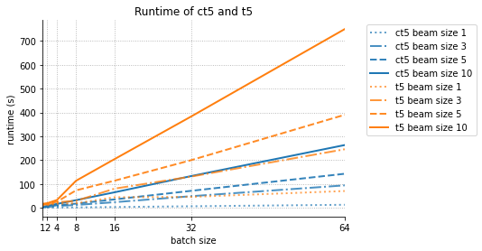

# chunked T5 (cT5)



A T5 model that uses a new loss where a special end-of-chunk token `</c>` is appended after sentinel tokens. 
The decoder has to predict the full input with masked tokens followed by `</c>`. 
This allows a much faster auto-regressive generation since the decoder can predict multiple tokens in parallel.

For example, for the input `the quick brown fox jumps over the lazy dog`:
```
encoder: the <extra_id_0> fox jumps <extra_id_1> the lazy dog

T5 decoder : <extra_id_0> quick brown <extra_id_1> over <extra_id_2>
cT5 decoder: <extra_id_0> quick brown </c> <extra_id_1> over </c> <extra_id_2>
```

The generation may look like this for T5 and cT5:
```
T5: <extra_id_0>
T5: <extra_id_0> quick
T5: <extra_id_0> quick brown
T5: <extra_id_0> quick brown <extra_id_1>
T5: <extra_id_0> quick brown <extra_id_1> over
T5: <extra_id_0> quick brown <extra_id_1> over <extra_id_2>
T5: <extra_id_0> quick brown <extra_id_1> over <extra_id_2> </s>

cT5: <extra_id_0> <pad> <extra_id_1> <pad> <extra_id_2>
cT5: <extra_id_0> quick <pad> <extra_id_1> over <pad> <extra_id_2>
cT5: <extra_id_0> quick brown <pad> <extra_id_1> over </c> <extra_id_2>
cT5: <extra_id_0> quick brown </c> <extra_id_1> over </c> <extra_id_2>
```

In the original T5, the decoder is called $n_s + 1 + \sum_i |s_i|$ times autoregressively, 
where $s_1,...,s_{n_s}$ are the predicted spans. 
In contrast, cT5's decoder is called only $max_i |s_i| + 1$ times. 
The generation stops when all sentences were fully translated to complete chunks, i.e., until all `</c>` tokens appear. 
Alternatively, you can also set `max_chunk_size` to manually force the model to stop after generating a chunk with `max_chunk_size` tokens.
The overhead of calling the decoder with a longer input is less pronounced since this computation can be parallelized in GPUs/TPUs.

## Huggingface Checkpoints

- ct5-small: https://huggingface.co/mtreviso/ct5-small-en-wiki


## Training details

cT5-small used T5's weights as a starting point, and then it was finetuned on the English [wikipedia](https://huggingface.co/datasets/wikipedia) for 3 epochs, achieving ~74% validation accuracy.
The training script is in JAX + Flax and can be found in `pretrain_ct5.py`.

Flax checkpoints can be converted to PyTorch via `convert_flax_to_pytorch.py [flax_dirname]`.


## Usage

```python
from transformers import AutoTokenizer
from modeling_ct5 import CT5ForConditionalGeneration

tokenizer = AutoTokenizer.from_pretrained("mtreviso/ct5-small-en-wiki")
model = CT5ForConditionalGeneration.from_pretrained("mtreviso/ct5-small-en-wiki")
```

For training:

```python
input_ids = tokenizer("The <extra_id_0> walks in <extra_id_1> park", return_tensors="pt").input_ids
labels = tokenizer("<extra_id_0> quick brown </c> <extra_id_1> over </c> <extra_id_2>", return_tensors="pt").input_ids
outputs = model(input_ids=input_ids, labels=labels)
loss = outputs.loss
logits = outputs.logits
```

For generation:

```python
texts = [
    "The <extra_id_0> walks in <extra_id_1> park",
    "UN Chief says there is no way to <extra_id_0> in Syria",
]
input_ids = tokenizer(texts, return_tensors="pt", padding=True).input_ids
generated_ids = model.generate(
    input_ids, 
    use_cache=False,  # important to set to False to avoid caching
    eoc_token_id=tokenizer.vocab['</c>'],  # important to set to the correct end-of-chunk id
    max_chunk_size=5,  # the default is 9999999, which is a large number
)
```

This will produce the following tokens:
```python
>>> ['<pad>', '<extra_id_0>', '▁Walking', '▁Trail', '</c>', '<extra_id_1>', '▁the', '</c>', '<extra_id_2>', '</s>']
>>> ['<pad>', '<extra_id_0>', '▁treat', '▁Syria', '</c>', '<extra_id_1>', '</s>', '<pad>', '<pad>', '<pad>']
```

You have to pass `use_cache=False` to `generate()` in order to avoid caching during the generation procedure as caching is not available for parallel decoding. 
Currently, parallel decoding is only supported for PyTorch (greedy search, greedy sampling, beam search, beam sampling) and JAX (greedy search and greedy sampling).

**Note on the beam search implementation**: my beam search implementation is slower than optimal.
This is because I use the structures provided by HuggingFace's implementation, namely, BeamScores and BeamHypotheses to store the beam search results for each chunk in the input.
That is, there are independent "beams" for each chunk rather than for each input sequence.
It is possible to make it faster by using a custom BeamScores and BeamHypotheses class, but I haven't done that yet.


## Evaluation

See the notebook `evaluate_ct5.ipynb` for an example of how to evaluate cT5 in terms of accuracy and perplexity.
The notebook `profile.ipynb` shows how to profile the model to get runtimes.

Here is a comparison between cT5 and T5 on a subset of the WikiText-103 dataset using deterministic greedy search:


 | Metric              | cT5       | T5         |
|---------------------|-----------|------------|
| **Exact match**       | **0.09**  | **0.10**   |
| **Edit distance ratio** | **0.58**  | **0.57**   |
| **Perplexity**          | **1.54**  | **3.36**   |
| **Time (seconds)**      | **10.69** | **118.43** |

On this toy dataset, cT5 has a lower perplexity while being faster than T5. However, more experiments are needed for a rigorous evaluation.
